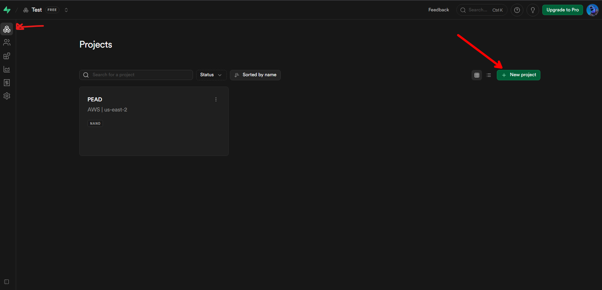
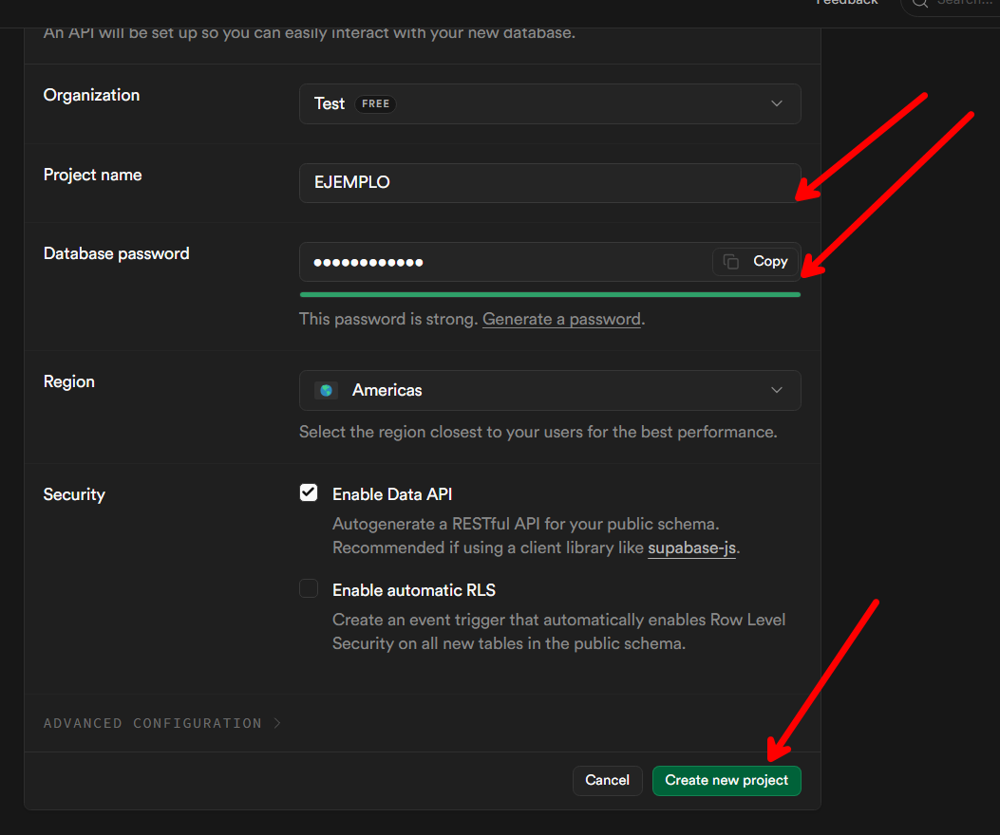
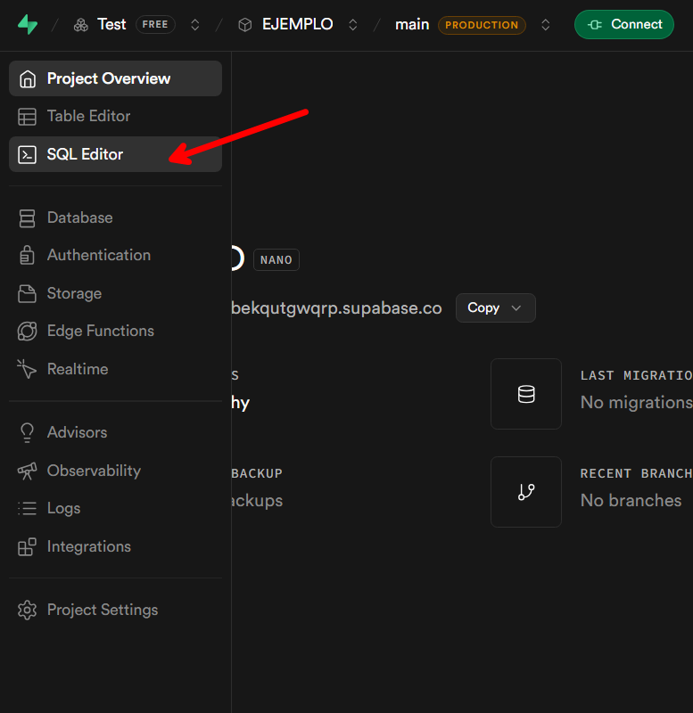
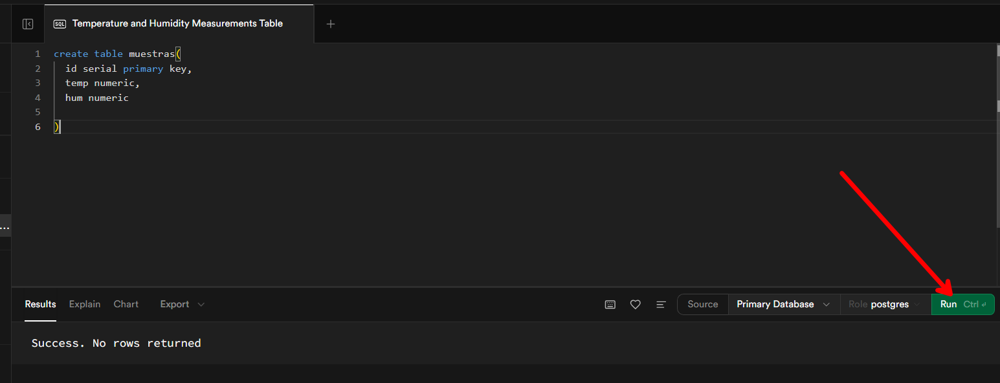
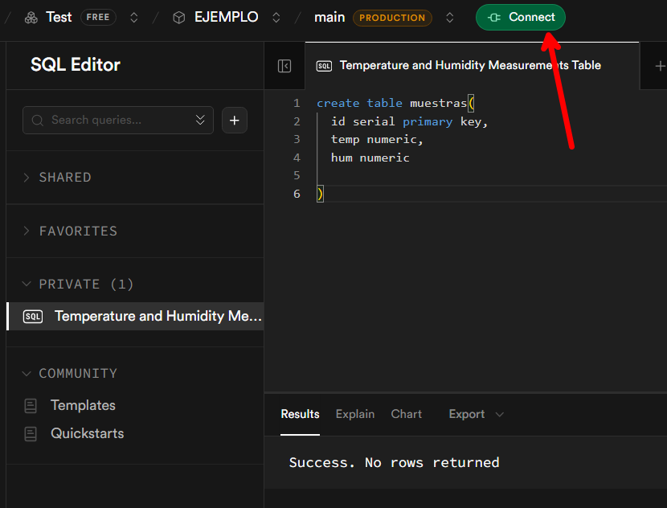
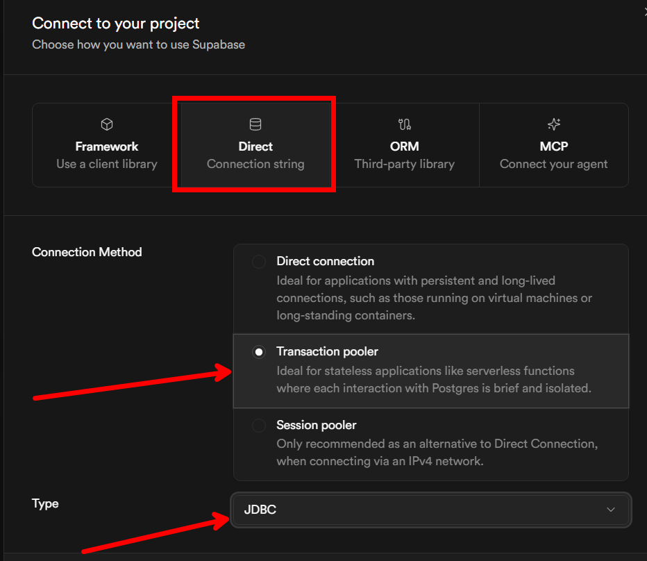
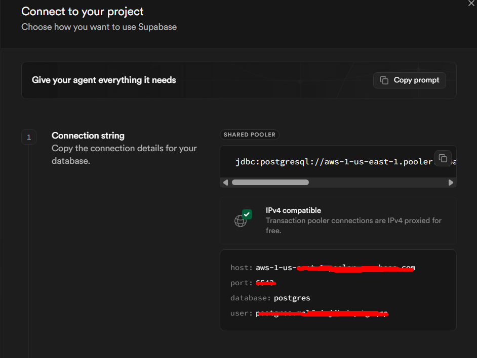

# SUPABASE:

Este readme es complementario al apartado de [Puerto Serial en Java (RECEPCIÓN DE DATOS)](notas.md).

No explicaré como crear una cuenta... es lo más fácil del mundo. Vamos directo a crear un proyecto y sacar las credenciales de conexión shall we?

## CREAR UN PROYECTO

Dentro de nuestra cuenta en el apartado de proyectos encontraremos el botón "New Proyect":



Llenamos los datos solicitados y camos en crear:



Dentro vamos a usar la opción SQL Editor para crear nuestra primer tabla:



Dentro escribirmos el comando deseado y damos clic en "RUN":

```sql
create table muestras(
  id serial primary key,
  temp numeric,
  hum numeric
)
```



# Obteniendo la cadena de conexión:

Damos clic en "Connect":



Seleccionamos la opción "Direct" y "Transaction pooler". El el typo de conexión seleccionamos "JDBC":



Y más abajo encontraremos la información que ocupamos:

