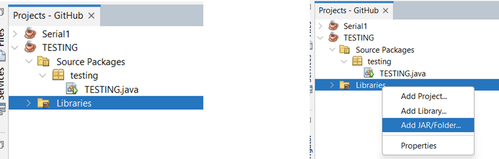
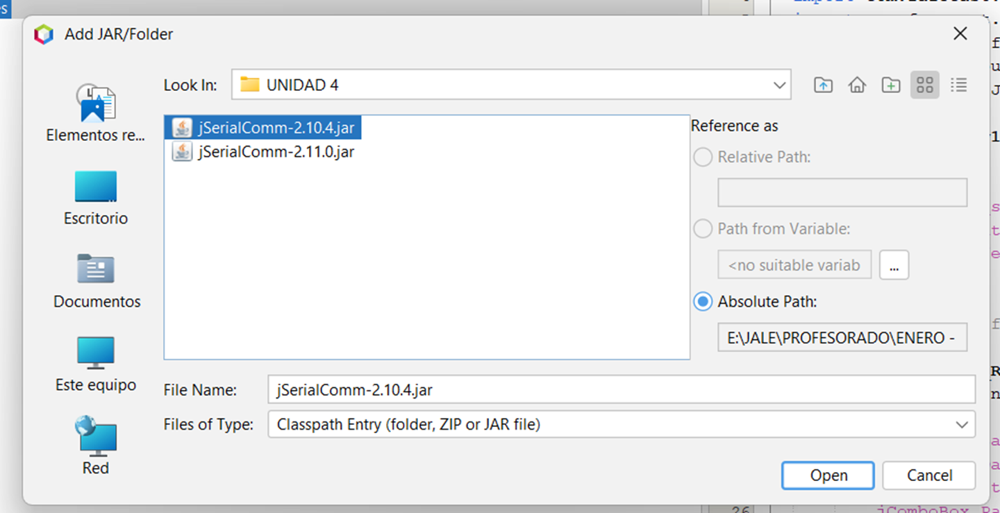
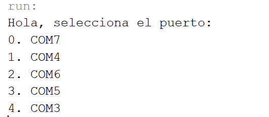
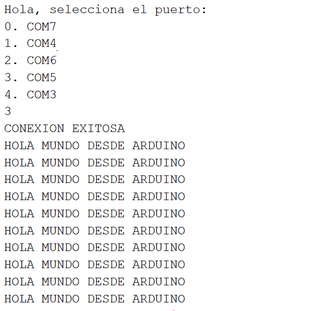
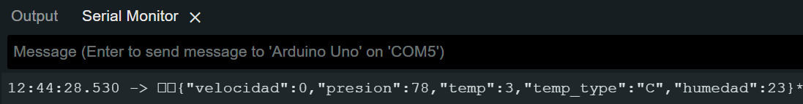
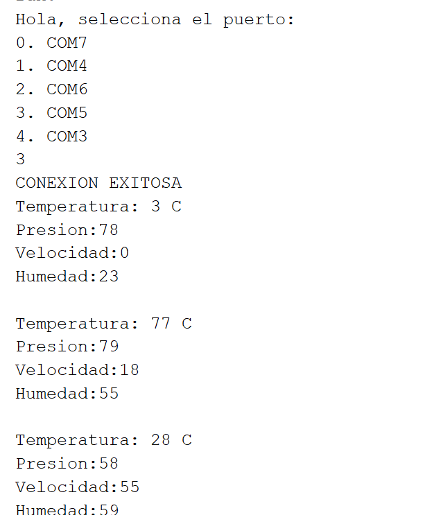
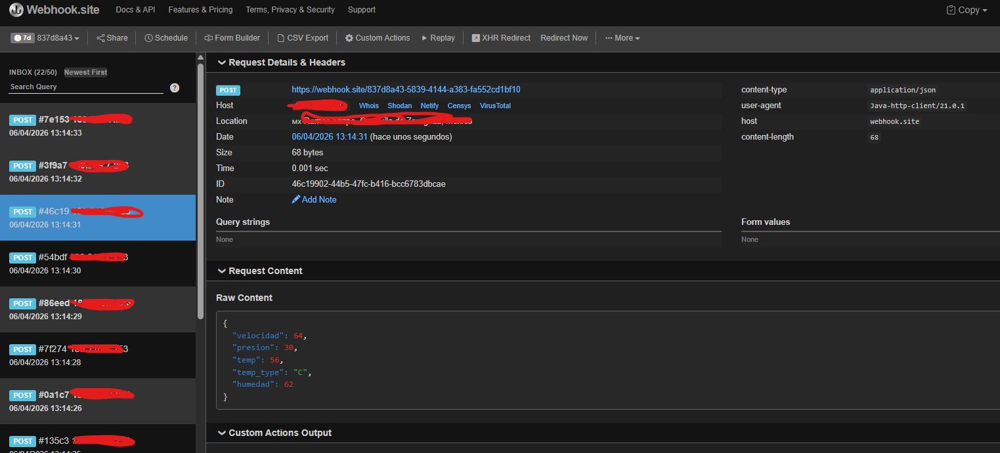
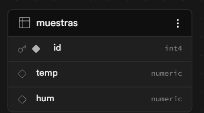
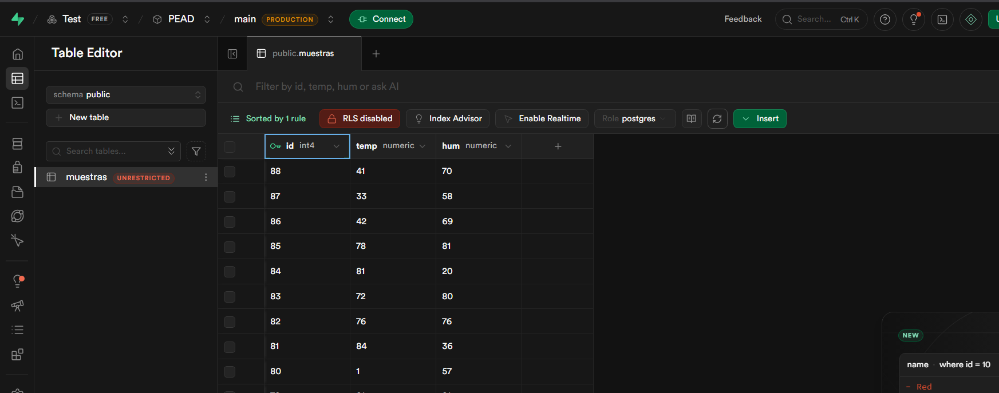

# Puerto Serial en Java (RECEPCIÓN DE DATOS)

Estoy haciendo este documento para mis estudiantes de PEAD 2026, pero que quede documentado para futuras generaciones. Y es que esto ya lo he explicado en clases anteriores con alumnos de eléctronica, electromecanica y pues en esta generación me gustaría tratarlo con los de sistemas.

Veamos. En Java, para recibir información desde el puerto Serial existen varias formas, la que voy a explicar aquí es la que más me ha resultado sencilla, y es usando la librería JSerialCom.

Puedes descargarla vía su sitio oficial:
https://fazecast.github.io/jSerialComm/

Ya teniendola en tu equipo (yo usaré la versión) 2.11.0 por que ya la tengo testeada. Recomiendo usar la misma (la cual dejaré en este repo) para estar en al misma sintonia.

Entonces, omitiendo la parte de crear el proyecto en java (yo usare neatbeans como IDE) vamos a importarla:

En nuestro proyecto generado vamos a la sección del visor de archivos, en la parte donde esta la carpeta "Libraries" damos clic derecho y seleccionamos "Add JAR/Folder":



Vamos y buscamos el archivo .jar deseado y damos click en "open":



(Esto solo lo explico por quienes lleguen por otros medios y no sepan como hacerlo).

------

# USO DE LA LIBRERÍA:

Para este ejemplo, vamos a ver un simple programa por consola para ver lo básico. Para los de sistemas en mi clase:

* Ustedes vienen de con el Profe. Loredo, ustedes deberían poder hacer una interfaz gráfica con lo que les muestre aquí. Se supone.

* Para quienes vienen conmigo de otra materia: dejaré un power point en este repo con una guia de como hacer un monitor serial en java tipo arduino. Nota: Puede que no este optimizado pero eso lo explico y muestro en clases, pero servirá como demo y/o como base si no puso atención en clase. (Los de sistemas: no haga trampa).

En fin, vamos a ver. En java voy a postear este código en nuestro main:

```java

static SerialPort con_serial;  //<--- la declaramos como variable global
static String textoRecibido=""; //<---- la declaramos como variable global

public static void main(String[] args) {
       int puerto=0;
       Scanner leer =  new Scanner(System.in);
       SerialPort[] portLists = SerialPort.getCommPorts();
       
       System.out.println("Hola, selecciona el puerto: ");
       for(int i=0; i<portLists.length;i++){
           System.out.println(i+". "+portLists[i].getSystemPortName());
       }
        puerto = leer.nextInt();
        con_serial =portLists[puerto];
        con_serial.setBaudRate(9600);
        con_serial.setNumDataBits(8);
        con_serial.setNumStopBits(1);
        con_serial.setParity(0);
        con_serial.openPort();
        
        if(con_serial.isOpen()){
            System.out.println("CONEXION EXITOSA");
            while(true){
                lectura(con_serial);
                sleep(1000);
            }
        }else{
            System.out.println("NO SE PUDO ESTABLECER UNA CONEXIÓN");
        }
        con_serial.closePort();
}
```

Expliquemos parte por parte. 

! Nota Importante antes de continuar:
```java
// Asegurate de importar las librerias que marca el editor en especial:
import com.fazecast.jSerialComm.*;
```
En fin, continuemos:


```java
       int puerto=0;   
       Scanner leer =  new Scanner(System.in);
       SerialPort[] portLists = SerialPort.getCommPorts();
       
       System.out.println("Hola, selecciona el puerto: ");
       for(int i=0; i<portLists.length;i++){
           System.out.println(i+". "+portLists[i].getSystemPortName());
       }
```

Describiendo línea por línea:

1. Declaramos una variable puerto, el cual funjirá como indice e indicará el puerto seleccionado.
2. Declaramos una variable tipo Scanner (leer) para la toma de datos del buffer del sistema.
3. Serial.getCommPorts: pide a java que solicite al sistema una lista de los puertos seriales registrados por el S.O. y los entregue en un formato de arreglo (el cual guardamos en la variable portLists).
4. Despues... recorremos este arreglo imprimiendo con .getSystemPortName() los nombres de los puertos disponibles en pantalla.

Con lo anterior podremos ver en pantalla algo como:



Luego tenemos:

```java
        puerto = leer.nextInt();
        con_serial =portLists[puerto];
        con_serial.setBaudRate(9600);
        con_serial.setNumDataBits(8);
        con_serial.setNumStopBits(1);
        con_serial.setParity(0);
        con_serial.openPort();
```

Como visto en clase... y si no lo explique lo explico ahora:

Para empezar, leemos el puerto seleccionado por el usuario (usandolo mediante la variable puerto).

Ahora para comunicarnos con el puerto serial debemos configurar un par de cosas como:

**.setBaudRate(int):** El baud rate o velocidad de comunicaciones, basicamente que tan rapido se va a estar mandando o enviando información por el puerto serial. Generalmente representado por un número entero.
**.setNumDataBits(int):** representa cuantos bits serán contemplados para representar información útil durante las transmisiones.
**.setNumStopBits(int):** cuantos bits deben contemplarse para identificar el fin de un carácter (una sola letra). Basicamente le estás diciendo a la computadora que espere 1 bit de tiempo en alto después de cada 8 bits de datos. Es como el espacio entre letras en una palabra, no el punto final de una oración.
**.setParity(int):** define si se añade un bit adicional al final de cada carácter para verificar que los datos no se hayan corrompido durante el viaje. Existen 3 modos:

En realidad, las opciones en la librería jSerialComm suelen ser constantes como:

* SerialPort.NO_PARITY (Valor 0): El bit extra se pone en 0 o 1 para que el total de "unos" en el mensaje sea par.
* SerialPort.ODD_PARITY (Valor 1): El bit extra se asegura de que el total de "unos" sea impar.
* SerialPort.EVEN_PARITY (Valor 2): No se envía ningún bit de revisión (es lo que usa Arduino por defecto).

Y pues la instrucción .openPort() indica lo que sugiere, intenta abrir el puerto.

Ahora:

```java
 if(con_serial.isOpen()){
            System.out.println("CONEXION EXITOSA");
            while(true){
                lectura(con_serial);
                sleep(1000);
            }
        }else{
            System.out.println("NO SE PUDO ESTABLECER UNA CONEXIÓN");
        }
        con_serial.closePort();
```

Una aclaratoria, por buenas practicas, todo el código anterior y esta parte debería estar encerrado en un try/catch, de momento no lo hago por temas de practicidad y pues... es un ejemplo. En fin, prosigamos:

1. Si logramos abrir el puerto (instruccion) satisfactoriamente:

Entonces pasamos a ciclar el programa en un while, de momento pondremos un while infinito solo para la demostración. Este while ejecutará la función lectura (de la cual aún no posteo el código) y esperará un segundo antes de volver a repetir el ciclo.

2. Si no abrió el puerto, muestro un mensaje y con .closePort() cierro las comunicaciones.

Aclaratorias:
En interfaces gráficas no necesitariamos de un while para mantener vivo el programa, ya que liberías como swing o fx ya manejan esto por nosotros. En teoria solo tendríamos que mandar llamar al listener (ahorita lo vemos) y ya.

---

Antes de pasar a ver la función lectura posteo este código:

```java
    static void sleep(int i){
        try{
             Thread.sleep(i);
        }catch(Exception e){
            System.out.println("Error al dormir");
        }
    }
```
Básicamente es nuestra función sleep, donde el parametro i indica el número de milisegundos que java tiene que "dormir". Esta función tampoco es necesaria en interfaces gráficas debido a que esto se maneja diferente.

Ahora si, al función lectura:

```java
static void lectura(SerialPort activePort){
              // Read response (assuming data is available)
        byte[] readBuffer = new byte[1024];
        int numBytesRead = activePort.readBytes(readBuffer, 1024);
        if (numBytesRead > 0) {
            String response = new String(readBuffer, 0, numBytesRead);
            textoRecibido=textoRecibido+response;
            //System.out.println(textoRecibido);
            if(textoRecibido.endsWith("*")==true){
                textoRecibido=textoRecibido.substring(0, textoRecibido.indexOf("*"));
                System.out.println(textoRecibido);
                textoRecibido="";
                
            }
        }
}
```

1. Declaro una variable llamada readBuffer de tipo byte (nos ayudará a leer los bytes que lleguen desde el puerto serial).
2. con .readBytes(buffer, tamaño del buffer): leeo lo que haya llegado por el puerto serial en ese instante, pueden ser 1, 2, miles de bytes según la rápidez del puerto. Lo leido lo deberá guardar la la variable **readBuffer**. (En este caso, se trata a la variable **readBuffer** como un puntero. Ahora los 1024 indican el tamaño del buffer que deseamos tratar, en este caso debe coincidier con el tamaño del arreglo **readBuffer**). La función por último retorna el número de bytes leidos y los almacena en la variable numBytesRead.
3. En nuestro if indicamos que si se recibió al menos 1 byte entonces:

Convertimos el monton de bytes del buffer a una cadena de texto tipo string con el constructor String(bytes, offset, totalBytes) y lo guardamos en la variable **response**.

**Nota importante:**
Cuando enviamos cosas por el puerto seríal, este administra el envío y los manda en forma de paquetes o pequeñas porciones. Entonces si mando la palabra: HOLA MUNDO COMO ESTAN

Para el puerto serial puede ser muy largo el mensaje para enviarlo de un solo golpe. Entonces lo puede a partir en pequeños pedasos como:

PAQUETE 1: HOL
PAQUETE 2: A MUN
PAQUETE 3: DO CO
PAQUETE 4: MO EST
PAQUETE 5: AN \n

Si notas esto es impractico, pues nos obliga a ver que existe una especie de cuello de botella, pues... tenemos que indicarle a java que no debe hacer nada hasta que reciba toda la información antes de hacer algo. Entonces....

```java
textoRecibido=textoRecibido+response;
            //System.out.println(textoRecibido);
            if(textoRecibido.endsWith("*")==true){
                textoRecibido=textoRecibido.substring(0, textoRecibido.indexOf("*"));
                System.out.println(textoRecibido);
                textoRecibido="";
                
            }
```
Notas la variable **textoRecibido**? Bueno, precisamente para eso sirve, esa variable va juntando las porciones recibidas y las va concatenando.


Cuando ella reconoce que el último caracter de la última porción recibida es un * por ejemplo, es en ese entonces en que podemos reconocer que el mensaje llegó completo y ahora si podemos o debemos hacer algo.

**NOTA:** para este ejemplo estamos usando el caracter *, pero por lo regular lo mas común es identificar el fin de un mensaje usando el salto de línea \n. Por temas didacticos y ser explicitos seguiré usando el *.

Para el ejemplo lo único que estamos haciendo de momento es mostrar el mensaje recibido en consola (despues de quitar con la función substring el asterico del mensaje claro esta).

Ya por último limpiamos la variable **textoRecibido** para recibir un nuevo mensaje.

De momento nos debió quedar un código como el siguiente:

```java

package serial_recepcion;

import java.util.Scanner;
import com.fazecast.jSerialComm.*;

public class Serial_recepcion {

    static SerialPort con_serial;
    static String textoRecibido="";

    public static void main(String[] args) {
       int puerto=0;
       Scanner leer =  new Scanner(System.in);
       SerialPort[] portLists = SerialPort.getCommPorts();
       
       System.out.println("Hola, selecciona el puerto: ");
       for(int i=0; i<portLists.length;i++){
           System.out.println(i+". "+portLists[i].getSystemPortName());
       }
       puerto = leer.nextInt();
        con_serial =portLists[puerto];
        con_serial.setBaudRate(9600);
        con_serial.setNumDataBits(8);
        con_serial.setNumStopBits(1);
        con_serial.setParity(0);
        con_serial.openPort();
        
        if(con_serial.isOpen()){
            System.out.println("CONEXION EXITOSA");
            while(true){
                lectura(con_serial);
                sleep(1000);
            }
        }else{
            System.out.println("NO SE PUDO ESTABLECER UNA CONEXIÓN");
        }
        con_serial.closePort();
    }
    
    static void lectura(SerialPort activePort){
              // Read response (assuming data is available)
        byte[] readBuffer = new byte[1024];
        int numBytesRead = activePort.readBytes(readBuffer, 1024);
        if (numBytesRead > 0) {
            String response = new String(readBuffer, 0, numBytesRead);
            textoRecibido=textoRecibido+response;
            //System.out.println(textoRecibido);
            if(textoRecibido.endsWith("*")==true){
                textoRecibido=textoRecibido.substring(0, textoRecibido.indexOf("*"));
                System.out.println(textoRecibido);
                textoRecibido="";
                
            }
        }
    }
    static void sleep(int i){
        try{
             Thread.sleep(i);
        }catch(Exception e){
            System.out.println("Error al dormir");
        }
    }
}

```

Vamos a probarlo, usemos este código en arduino:

```c++
void setup() {
  Serial.begin(9600);

}

void loop() {
  // put your main code here, to run repeatedly:
  Serial.print("HOLA MUNDO DESDE ARDUINO");
  Serial.print("*");
  delay(1000);
}
```

Deberiamos poder recibir datos y velos en la consola:



----
# JSON

Ahora compliquemos esto un poco más ¿Quieren?
Si bien esto es didáctico... bueno, recibir una cadena de texto es poco útil. ¿Qué pasa si deseamos expandir esto y queremos recibir varios datos simultaneamente? 

Como visto en clase podemos aplicar la del data Streamer de Excel, mandar los datos separados por comas y luego procesarlas y así. Pero para adaptarnos un poco a cosas más practicas y estandar (por ahora) del mercado vamos a usar JSON (que también ya se anda quedando atrás).

No me detendre a explicar que es JSON en esta entrada, tampoco detallaré a grandes rasgos las librerías a usar. Para esto último dejaré un power point en el repositorio y lo compartiré en clase, vaya a LEER.

Pero bueno, veamos. Supongase que quiero enviar desde ARDUINO datos random como:

* velocidad
* presión
* temperatura
* temp_type
* humedad

Podríamos envir un json como:

```json
    {
        "velocidad":10,
        "presion":20,
        "temp":40,
        "temp_type":"C",
        "humedad": 99
    }
```

¿Cómo construyo y mando esto desde arduino?

Bueno, analicemos este código:

```c++
#include <ArduinoJson.h> //<--- LA LIBRERIA PARA MANEJAR JSON EN ARDUINO
//NOTA: Este ejemplo usa la versión 7.0.4 de la librería

void setup() {
  Serial.begin(9600);
  randomSeed(200); //GENERO UNA SEMILLA PARA DATOS ALEATORIOS
}

JsonDocument datos; //VARIABLE PARA MANIPULAR JSON

void loop() {

  //GENERO NUMEROS ALEATORIOS DE MUESTRA PARA MIS DATOS  
  int vel           = random(0,100);
  int presion       = random(0,100);
  int temp          = random(0,100);
  String temp_type  = "C";
  int humedad       = random(0,100);

  //ARMO EL JSON SEGÚN LAS ESPECIFICACIONES QUE PEDÍ:  
  datos["velocidad"] = vel;
  datos["presion"]   = presion;
  datos["temp"]      = temp;
  datos["temp_type"] = temp_type;
  datos["humedad"]   = humedad;

  //SERIALIZE toma los datos generados, los formatea en json y los manda por el puerto serie
  serializeJson(datos, Serial);
  Serial.print("*"); //<---- mando el caracter de finalización
  delay(1000); //un delay de 1 segundo para no saturarlo.
}

```

El anterior código estaría mandando un json "hacia java" en este formato:



Nota que la librería ya hace toda la tarea por nosotros. Ahora vamos a procesarlo en java.

### En java

Para procesar esto debemos importar una librería de terceros así como hemos hecho con JSerialComm. En este caso usaremos a JSON-java, puedes bajarlo de aquí:

https://github.com/stleary/JSON-java

Y si no, dejaré el .jar en este repositorio. Usaré la versión liberada en 20240303 por que ya la tengo probada.

En fin, revisa este código:

```java
static void lectura(SerialPort activePort){
              // Read response (assuming data is available)
        byte[] readBuffer = new byte[1024];
        int numBytesRead = activePort.readBytes(readBuffer, readBuffer.length);
        if (numBytesRead > 0) {
            String response = new String(readBuffer, 0, numBytesRead);
            textoRecibido=textoRecibido+response;
            //System.out.println(textoRecibido);
            if(textoRecibido.endsWith("*")==true){
                textoRecibido=textoRecibido.substring(0, textoRecibido.indexOf("*"));
                //System.out.println(textoRecibido); <-- esta linea se comentó
                
                /*CODIGO NUEVO: */
                JSONObject json = new JSONObject(textoRecibido);

                int temp            = json.getInt("temp");
                String temp_type    = json.getString("temp_type");
                int presion         = json.getInt("presion");
                int velocidad       = json.getInt("velocidad");
                int humedad         = json.getInt("humedad");
                
                 System.out.println("Temperatura: "+ temp+" "+temp_type);
                System.out.println("Presion:"+ presion);
                System.out.println("Velocidad:"+velocidad);
                System.out.println("Humedad:"+humedad);
                System.out.println("");
                //FIN DEL CÓDIGO NUEVO
                textoRecibido="";
                
            }
        }
    }
```

Nota que ahora tras tener el mensaje completo lo pasamos al constructor JSONObject para usar la variable **json** como nuestro almacen de datos. Con las funciones 

* .getInt("key")
* .getDouble("key")
* .getString("key")
* etc

Extraemos el valor que se ocupe y lo usamos para despues. Vease el resultado en consola:




EXTRA:

Accedamos a :

https://webhook.site/

Este es un sitio para probar apps que usan APIs. En este caso vamos a copiar el enlace que nos generó:


Y vamos a usarlo de la siguiente manera:

En java agreguemos esta función y reemplaza la url por la que te generó:

```java

/*LIBRERIAS OCUPADAS:*/
import java.net.URI;
import java.net.http.HttpClient;
import java.net.http.HttpRequest;
import java.net.http.HttpResponse;

static void enviarALaNube(String jsonParaEnviar) {
    // 1. Reemplaza con la URL que te dé Webhook.site
    String urlDestino = "https://webhook.site/tu-id-unico-aqui";

    try {
        HttpClient client = HttpClient.newHttpClient();

        // 2. Construir la petición POST
        HttpRequest request = HttpRequest.newBuilder()
                .uri(URI.create(urlDestino))
                .header("Content-Type", "application/json") // Le avisamos que mandamos JSON
                .POST(HttpRequest.BodyPublishers.ofString(jsonParaEnviar))
                .build();

        // 3. Enviar de forma asíncrona (¡Importante para no bloquear el Serial!)
        client.sendAsync(request, HttpResponse.BodyHandlers.ofString())
              .thenAccept(response -> {
                  System.out.println("Nube actualizada. Código: " + response.statusCode());
              });

    } catch (Exception e) {
        System.err.println("Error al conectar con la API: " + e.getMessage());
    }
}
```

Tendremos al final un código como:

```java

package serial_recepcion;

import java.util.Scanner;
import com.fazecast.jSerialComm.*;
import java.net.URI;
import java.net.http.HttpClient;
import java.net.http.HttpRequest;
import java.net.http.HttpResponse;
import org.json.JSONObject;

public class Serial_recepcion2 {

    static SerialPort con_serial;
    static String textoRecibido="";

    public static void main(String[] args) {
       int puerto=0;
       Scanner leer =  new Scanner(System.in);
       SerialPort[] portLists = SerialPort.getCommPorts();
       
       System.out.println("Hola, selecciona el puerto: ");
       for(int i=0; i<portLists.length;i++){
           System.out.println(i+". "+portLists[i].getSystemPortName());
       }
       puerto = leer.nextInt();
        con_serial =portLists[puerto];
        con_serial.setBaudRate(9600);
        con_serial.setNumDataBits(8);
        con_serial.setNumStopBits(1);
        con_serial.setParity(0);
        con_serial.openPort();
        
        if(con_serial.isOpen()){
            System.out.println("CONEXION EXITOSA");
            while(true){
                lectura(con_serial);
                sleep(1000);
            }
        }else{
            System.out.println("NO SE PUDO ESTABLECER UNA CONEXIÓN");
        }
        con_serial.closePort();
    }
    
    static void lectura(SerialPort activePort){
              // Read response (assuming data is available)
        byte[] readBuffer = new byte[1024];
        int numBytesRead = activePort.readBytes(readBuffer, 1024);
        if (numBytesRead > 0) {
            String response = new String(readBuffer, 0, numBytesRead);
            textoRecibido=textoRecibido+response;
            //System.out.println(textoRecibido);
            if(textoRecibido.endsWith("*")==true){
                textoRecibido=textoRecibido.substring(0, textoRecibido.indexOf("*"));
                //System.out.println(textoRecibido);
                
                /*CODIGO NUEVO: */
                JSONObject json = new JSONObject(textoRecibido);

                int temp            = json.getInt("temp");
                String temp_type    = json.getString("temp_type");
                int presion         = json.getInt("presion");
                int velocidad       = json.getInt("velocidad");
                int humedad         = json.getInt("humedad");
                
                System.out.println("Temperatura: "+ temp+" "+temp_type);
                System.out.println("Presion:"+ presion);
                System.out.println("Velocidad:"+velocidad);
                System.out.println("Humedad:"+humedad);
                System.out.println("");
                
                enviarALaNube(textoRecibido); //aqui llamamos a la función
                 
                //FIN DEL CÓDIGO NUEVO
                textoRecibido="";
                //enviar(activePort, "HOLA DESDE JAVA");
            }
        }
    }
    static void sleep(int i){
        try{
             Thread.sleep(i);
        }catch(Exception e){
            System.out.println("Error al dormir");
        }
    }
    
    static void enviarALaNube(String jsonParaEnviar) {
        // 1. Reemplaza con la URL que te dé Webhook.site
        String urlDestino = "https://webhook.site/[id]";

        try {
            HttpClient client = HttpClient.newHttpClient();

            // 2. Construir la petición POST
            HttpRequest request = HttpRequest.newBuilder()
                    .uri(URI.create(urlDestino))
                    .header("Content-Type", "application/json") // Le avisamos que mandamos JSON
                    .POST(HttpRequest.BodyPublishers.ofString(jsonParaEnviar))
                    .build();

            // 3. Enviar de forma asíncrona (¡Importante para no bloquear el Serial!)
            client.sendAsync(request, HttpResponse.BodyHandlers.ofString())
                  .thenAccept(response -> {
                      System.out.println("Nube actualizada. Código: " + response.statusCode());
                  });

        } catch (Exception e) {
            System.err.println("Error al conectar con la API: " + e.getMessage());
        }
    }
}

```

Si ejecutamos este código estaremos mandando información a internet:




Y lo curioso es... estoy usando un arduino UNO para esto, el cual no tiene antena wifi ni nada, es mi pc quien procesa todo esto.

> **NOTA:** De preferencia cambia el delay en arduino a cada 5 o 10 segundos, para que no nos bloquee por spam o DDOS. (Como a mí... :c a ver cuando me desbloquean la IP).

Otro sitio que puedes usar es:

https://pipedream.com/

Solo que hay que hacer cuenta en el sitio.

---

# ENVIO DE DATOS A SERVICIOS DE DB

Para este ejemplo usaremos supabase:

https://supabase.com

Y el driver de postgresql que puedes bajar para java aquí:

https://jdbc.postgresql.org/download/

En este caso, igualmente lo estaré dejando en el repositorio. Usaremos para este ejemplo la versión 42.7.10. Acuerdate de agregar esta librería al proyecto o te marcará puros errores.

En nuestro código vamos a agregar una función más:

```java

    //LIBRERIAS:
    import java.sql.Connection;
    import java.sql.DriverManager;
    import java.sql.PreparedStatement;
    import java.sql.SQLException;


    public static void guardarEnBD(int t, int h) {
            // RECUERDA: jdbc:postgresql://[HOST]:[PUERTO]/[DB_NAME]


            String url = "jdbc:postgresql://[HOST DE SUPABASE]:[PUERTO]/[NOMBRE_DB]";
            String user = "[USUARIO]";
            String pass = "[CONTRASEÑA]";
            
            try{
                Class.forName("org.postgresql.Driver");

                try (Connection conn = DriverManager.getConnection(url, user, pass)) {
                    String query = "INSERT INTO muestras (temp, hum) VALUES (?, ?)";
                    PreparedStatement pstmt = conn.prepareStatement(query);
                    pstmt.setDouble(1, t);
                    pstmt.setDouble(2, h);

                    pstmt.executeUpdate();
                    System.out.println(">>> [DB] Éxito: T=" + t + " H=" + h);
                    
                    conn.close();

                } catch (Exception e) {
                    System.err.println(">>> [DB] Error: " + e.getMessage());
                }
            }catch(Exception e){
                System.out.println("Error al conectar BD: "+e.getMessage());
            }
    }

```

Para este ejemplo, los datos que tenemos del lado de java los mandaremos a una tabla en una base de datos en línea. La tabla tiene solo 3 columnas:



Si tienes dudas sobre como crear la tabla y sacar la cadena de conexión revisa el archivo: [SUPABASE.md](SUPABASE.md)

Para conectarnos, una vez que ya tengas dada de alta tu cuenta en supabase... y que hayas creado la tabla y la cadena de conexión simplemente es cuestión de reemplazar código.

El final tendremos un código como:

```java

package serial_recepcion;

import java.util.Scanner;
import com.fazecast.jSerialComm.*;

import java.net.URI;
import java.net.http.HttpClient;
import java.net.http.HttpRequest;
import java.net.http.HttpResponse;
import org.json.JSONObject;

//librerias postgres y sql:
import java.sql.Connection;
import java.sql.DriverManager;
import java.sql.PreparedStatement;
import java.sql.SQLException;

public class Serial_recepcion2 {

    static SerialPort con_serial;
    static String textoRecibido="";

    public static void main(String[] args) {
       int puerto=0;
       Scanner leer =  new Scanner(System.in);
       SerialPort[] portLists = SerialPort.getCommPorts();
       
       System.out.println("Hola, selecciona el puerto: ");
       for(int i=0; i<portLists.length;i++){
           System.out.println(i+". "+portLists[i].getSystemPortName());
       }
       puerto = leer.nextInt();
        con_serial =portLists[puerto];
        con_serial.setBaudRate(9600);
        con_serial.setNumDataBits(8);
        con_serial.setNumStopBits(1);
        con_serial.setParity(0);
        con_serial.openPort();
        
        if(con_serial.isOpen()){
            System.out.println("CONEXION EXITOSA");
            while(true){
                lectura(con_serial);
                sleep(1000);
            }
        }else{
            System.out.println("NO SE PUDO ESTABLECER UNA CONEXIÓN");
        }
        con_serial.closePort();
    }
    
    static void lectura(SerialPort activePort){
              // Read response (assuming data is available)
        byte[] readBuffer = new byte[1024];
        int numBytesRead = activePort.readBytes(readBuffer, readBuffer.length);
        if (numBytesRead > 0) {
            String response = new String(readBuffer, 0, numBytesRead);
            textoRecibido=textoRecibido+response;
            //System.out.println(textoRecibido);
            if(textoRecibido.endsWith("*")==true){
                textoRecibido=textoRecibido.substring(0, textoRecibido.indexOf("*"));
                //System.out.println(textoRecibido);
                
                /*CODIGO NUEVO: */
                JSONObject json = new JSONObject(textoRecibido);

                int temp            = json.getInt("temp");
                String temp_type    = json.getString("temp_type");
                int presion         = json.getInt("presion");
                int velocidad       = json.getInt("velocidad");
                int humedad         = json.getInt("humedad");
                
                System.out.println("Temperatura: "+ temp+" "+temp_type);
                System.out.println("Presion:"+ presion);
                System.out.println("Velocidad:"+velocidad);
                System.out.println("Humedad:"+humedad);
                System.out.println("");
                
                //enviarALaNube(textoRecibido);
                 guardarEnBD(temp, humedad);
                //FIN DEL CÓDIGO NUEVO
                textoRecibido="";
                //enviar(activePort, "HOLA DESDE JAVA");
            }
        }
    }
    static void sleep(int i){
        try{
             Thread.sleep(i);
        }catch(Exception e){
            System.out.println("Error al dormir");
        }
    }
    
    static void enviarALaNube(String jsonParaEnviar) {
        // 1. Reemplaza con la URL que te dé Webhook.site
        String urlDestino = "https://eojsbwr4xeb9jj1.m.pipedream.net";

        try {
            HttpClient client = HttpClient.newHttpClient();

            // 2. Construir la petición POST
            HttpRequest request = HttpRequest.newBuilder()
                    .uri(URI.create(urlDestino))
                    .header("Content-Type", "application/json") // Le avisamos que mandamos JSON
                    .POST(HttpRequest.BodyPublishers.ofString(jsonParaEnviar))
                    .build();

            // 3. Enviar de forma asíncrona (¡Importante para no bloquear el Serial!)
            client.sendAsync(request, HttpResponse.BodyHandlers.ofString())
                  .thenAccept(response -> {
                      System.out.println("Nube actualizada. Código: " + response.statusCode());
                  });

        } catch (Exception e) {
            System.err.println("Error al conectar con la API: " + e.getMessage());
        }
    }
    
    
    public static void guardarEnBD(int t, int h) {
            // RECUERDA: jdbc:postgresql://[HOST]:[PUERTO]/[DB_NAME]
            String url = "jdbc:postgresql://[HOST DE SUPABASE]:[PUERTO]/[NOMBRE_DB]";
            String user = "[USUARIO]";
            String pass = "[CONTRASEÑA]";
            
            try{
                Class.forName("org.postgresql.Driver");

                try (Connection conn = DriverManager.getConnection(url, user, pass)) {
                    String query = "INSERT INTO muestras (temp, hum) VALUES (?, ?)";
                    PreparedStatement pstmt = conn.prepareStatement(query);
                    pstmt.setDouble(1, t);
                    pstmt.setDouble(2, h);

                    pstmt.executeUpdate();
                    System.out.println(">>> [DB] Éxito: T=" + t + " H=" + h);
                    
                    conn.close();

                } catch (Exception e) {
                    System.err.println(">>> [DB] Error: " + e.getMessage());
                }
            }catch(Exception e){
                System.out.println("Error al conectar BD: "+e.getMessage());
            }
        }
    }

```


Al final si todo esta bien deberíamos poder ver en nuestra consola sql (aplicando un select) los datos recabados de nuestro sensor:



